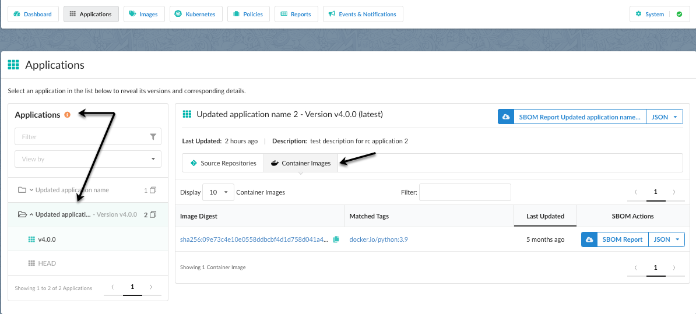
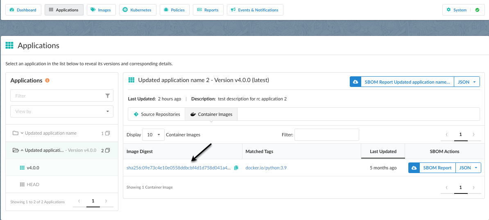
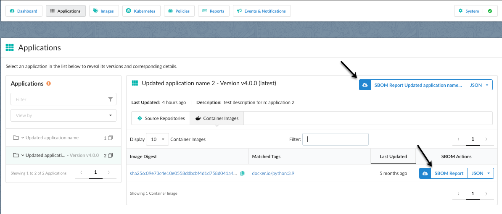
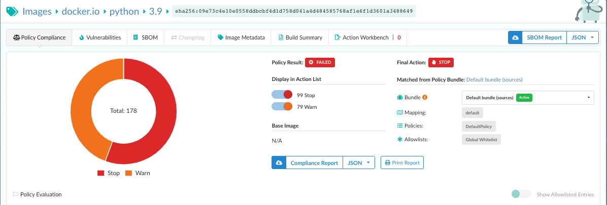
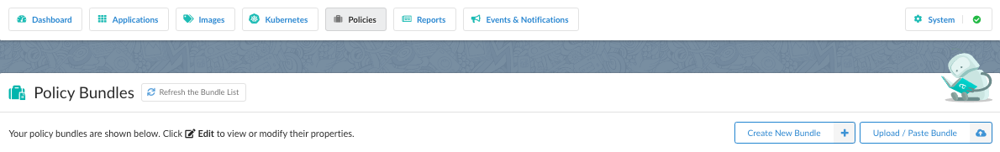

To work with image container data, you must first load the image container data into the Application view of Enterprise. Once your data is brought in, you can go to **Applications** to see the summary of the information. The information is categorized by applications, with sub-categories of application versions available from container images. 
For information about analyzing images, see [Image Analysis](https://docs.anchore.com/current/docs/using/ui_usage/images/).
For information about adding Images, see [Scanning Repositories](https://docs.anchore.com/current/docs/using/cli_usage/repositories/).

When you select an application version, you will see a list of artifacts associated with that application version.

You can download a report in JSON format for everything in an application. Or, you can download a report for everything in an artifact.

When you select an artifact link, you will see the analysis options for that artifact. You can then view information about the artifact, such as the policies set up, the vulnerabilities, SBOM contents, image metadata information, build summary, and action workbench. 

If you want to set up policies and policy bundles, as well as mappings for an artifact, select **Policies* to set them up there. 

See [Policies](https://docs.anchore.com/current/docs/using/ui_usage/policies/) for more information.
See [Policy Mappings](https://docs.anchore.com/current/docs/using/ui_usage/policies/mappings/) for more information.

