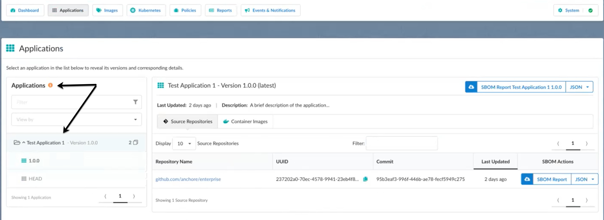
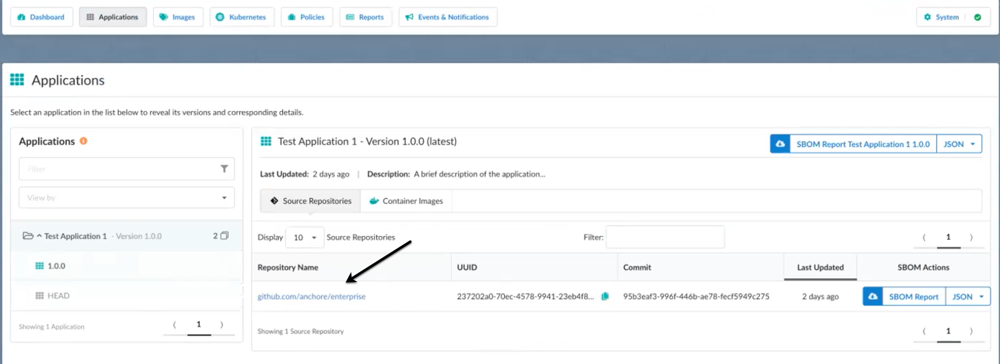
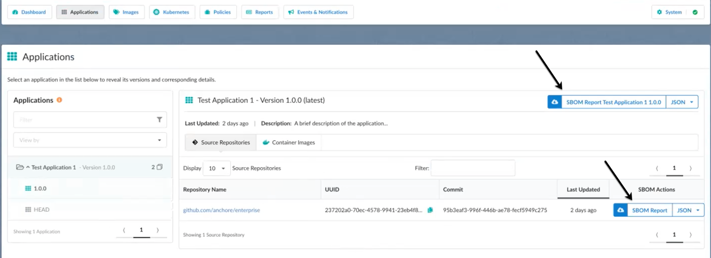
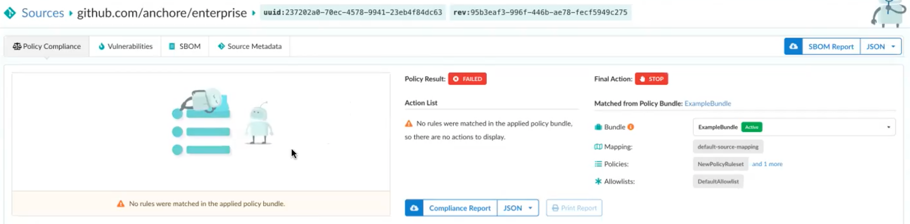
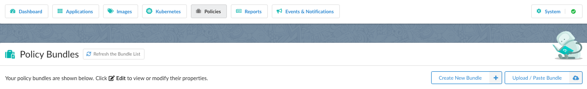

To work with source repository data, you must first use AnchoreCTL or the Anchore API to load the source repository into the Applications view of Enterprise.

See [Anchore Enterprise Application Groups](https://docs.anchore.com/current/docs/sbom_management/application_groups) for more information.

Once your data is brought in, you can go to the **Applications** tab to see the summary of the information. The information is categorized by applications, with sub-categories of application versions available from source repositories. 

When you select an application version, you will see a list of artifacts associated with that application version.

You can download a report in JSON format for everything in an application. Or, you can download a report for everything in an artifact.

When you select an artifact link, you will see the analysis options for that artifact. You can then view information about the artifact, such as the policies set up, the vulnerabilities, SBOM contents, and source metadata information. See [How to work with Applications generated from Source Repositories](https://docs.anchore.com/current/docs/sbom_management/work_applications_generated_from_source_repositories) for more information.

If you want to set up policies and policy bundles, as well as mappings for an artifact, select the **Policies** tab and set them up there. 

For information about policies, see [Policies](https://docs.anchore.com/current/docs/using/ui_usage/policies/).
For information about adding policy mapping, see [Policy Mappings](https://docs.anchore.com/current/docs/using/ui_usage/policies/mappings/).

