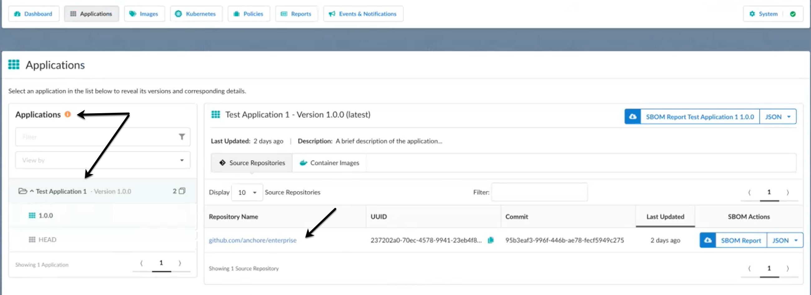
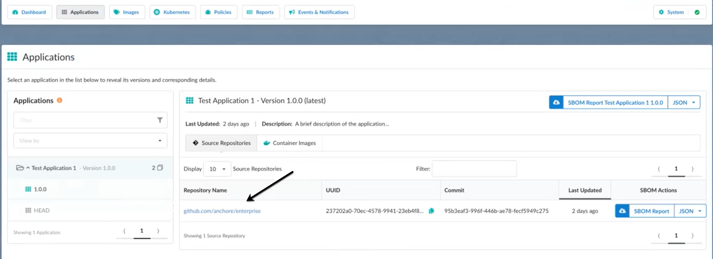

To work with source repository data in Anchore Enterprise, you must first use AnchoreCTL or the Anchore API to load the source repository into Enterprise. 

Once the data is made available to Anchore Enterprise, you can then view and generate reports specific to an application version. An example workflow might be as follows.

1. Start Anchore Enterprise. You will default to the dashboard view. The Dashboard is your configurable landing page where insights into the collective status of your source repository. The summary information is displayed through various widgets. Utilizing the Enterprise Reporting Service, the widgets are hydrated with metrics which are generated and updated on a cycle, the duration of which is determined by application configuration. See [Dashboard](https://docs.anchore.com/current/docs/using/ui_usage/dashboard/) for more information about what you can view.

2. Click **Applications** > **Source Repositories** to view a summary of the applications in your source repository. The information is categorized by applications, with sub-categories of application versions available from source repositories that you previously loaded via AnchoreCTL or the Anchore API. Notice the list of applications and application versions, as well as any artifacts in the applications.

3. Click **SBOM Report Updated Application name** to download a report in JSON format for everything in an application. Or, click **SBOM Report** to download a report for everything in an artifact.

4. Click an artifact link for a soure repository under **Repository Name** to view the detailed information for the artifact.

The Sources analysis screen for an artifact shows you a summary of what is in that artifact.

5. From the analysis screen, you can perform the following actions.

- Click **Policy Compliance** to view the policies and policy bundles set up for the artifact. You can see the policy rules that are set up as well. 
- Click **Vulnerabilities** to view the vulnerabilities associated with the artifact.
- Click **SBOM** to view the contents of the SBOM(s) associated with the artifact.
- Click **Source Metadata** to view the metadata information for the artifact.
- You have the option to click **SBOM Report** to download a report for everything in the artifact. 
- You also have the option to click **Compliance Report** to download a report that shows the compliance information in the artifact.

6. Click **Policies** to set up the rules for the analyzed source repository. The rules set up for an artifact source repository are different from what you apply to a container image.

See [Policies](https://docs.anchore.com/current/docs/using/ui_usage/policies/) for more information.
See [Policy Mappings](https://docs.anchore.com/current/docs/using/ui_usage/policies/mappings/) for more information.