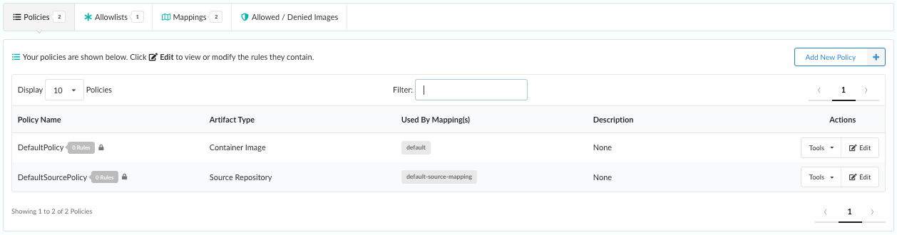

## What is a policy?

A _policy_ is composed of a set of rules that are used to perform an evaluation on a source repository or container image. These rules include (but are not limited to) checks on security, known vulnerabilities, configuration file contents, the presence of credentials, manifest changes, exposed ports, or any user defined checks.

Policies can be deployed site wide, or customized to run against specific sources, container images, or categories of application. For additional information, refer to the [Policy]() concepts section.

Once a policy has been applied to a source repository or image container, it can return one of two results:

 indicating that source or image *complies* with your policy

 indicating that the source or image is *non-compliant* with your policy.

### Rules

Each rule contained within a policy is configured with a check to perform—for example, `check if allowlisted package openssh-server present`. The policy additionally specifies the _action_ to take place, based on the result of the evaluation.

- STOP: Critical error that should stop the deployment by failing the policy evaluation.
- WARN: Issue a warning.
- GO: Ok to proceed. 

Policy rule checks are made up of *gates* and *triggers*. A gate is a set of policy checks against broad categories like vulnerabilities, secret scans, licenses, and so forth. It will include one or more triggers, which are checks specific to the gate category.

### Listing Policies

The area under the **Policies** sub-tab in the policy editor contains a table that lists the policies defined within a selected policy bundle. The numeric indicator represents the overall number of polices currently defined in the bundle.

Adjacent to each name in the policy list is a counter that indicates the number of rules within that policy.

**Note:** A lock icon next to the rule counter indicates that the policy cannot be deleted. Policy rules that are used by policy mappings in the bundle (which will be listed under the **Used By Mapping(s)** column entry) cannot be deleted until they are removed from every associated mapping.

#### Tools

The **Tools** dropdown menu in the **Actions** column provides options to:

- Edit the policy
- Copy the policy
- Download the policy as a JSON document
- Delete the policy (provided it is not being used by any policy mapping)

### Adding a New Policy 

You can add new policies to a policy bundle. 

1. Click **Add New Policy**. 
2. Select **Source Repository** if you want the new policy to apply to a source, or select **Container Image** to have the policy apply to an image.
3. Type a uniqe name for the new policy. You can, optionally, add a description. Click **OK**.
4. From the Edit Source Repository Policy Rules screen, set up the policy rules for the new policy. Start by selecting an item from the **Gate** dropdown list, where each item represents a category of policy checks. 
**Note**: If you are creating a policy rule for a source repository, only **vulnerabilities** are available.

5. After selecting a gate item, hover over the (i) indicator next to Gate to see additional descriptive details about the gate you have selected. 
6. Select the **Triggers** drop down and select a specific check that you want associated with this item, such as package, vulnerability data unavailable, and so on. Triggers may have parameters, some of which may be optional. If any optional parameters are associated with the trigger you select, these will also be displayed in an additional field where they can be added or removed. Optional parameters are described in more detail in the next section.

7. Select an action to apply to the policy rule. Choose **STOP**, **WARN**, or **GO**. The Action options are only displayed once all required parameters have been provided, or if no mandatory parameters are required. Once an action has been selected, the rule is added to the main list of rules contained in the policy. 
8. Click **Save and Close**.

### Editing Policies

Existing policies from a source repository or container image may be modified. 

1. From Actions, either select **Edit**, or **Tools** > **Edit Policy Rules**. You can also copy a policy, download the policy to JSON, or delete the policy. 

2. From the Edit Source Repository Policy Rules/Edit Container Image Policy Rules screen (depending on whether you choose to edit a policy for a source repository or container image), you can change the policy name and description. You can also change any documentation associated with individual policy rules by editing the descriptions presented within each row of the table.
Note: If you are editing a policy rule for a source repository, only vulnerabilities are available under Gate.

The following example shows a sophisticated policy check. The metadata gate has a single trigger that allows checks to be performed against various attributes of an image, including image size, architecture, and operating system distribution:

The **Attribute** parameter drop-down includes a number of attributes taken from image metadata, including the operating system distribution, number of layers, and architecture of the image (AMD64, ARM, and so forth):
Once an attribute has been selected, the **Check** dropdown is used to create a comparison expression:
The type of comparison varies based on the attribute. For example the numeric comparison operators such as `>`, `<`, `>=` would be relevant for numeric field such as size, while other operators such as `not in` may be useful for querying data field such as `distro`.
In this example, by entering `rhel centos oracle` in the **Value** field, our rule will check that the distro (that is, the operating system) under analysis is not RHEL, Centos, or Oracle.

### Optional Parameters

If a trigger has _optional_ parameters, they will be automatically displayed in the policy editor, and an editable field next to the **Triggers** drop-down will show all the current selections.

You can remove unneeded optional parameters by clicking the **X** button associated with each entry in the **Optional Parameters** list, or by clicking the **X** button within each associated parameter block.

If an optional parameter is removed, it can be reapplied to the rule by clicking the **Optional Parameters** field and selecting it from the resulting dropdown list.

### Editing Rules

After a rule has been added to the policy, you will see it in the the edit policy list page as a new entry. 

1. The final action of each rule can be modified by clicking the **STOP**, **WARN**, or **GO** buttons.

2. Click **Remove** to get rid of any unwanted rules.

3. Click **Edit** to edit the policy rule again.

4. After modifying the existing rule, click **Apply** and the rule will be updated. When you are satisfied that all your new (or updated) rules are correct, you can click the **Save new rule, and Close** button to update and store your policy bundle.
