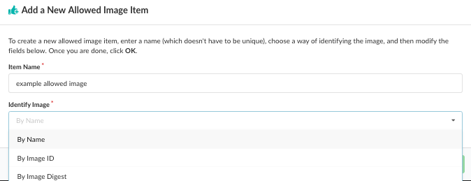
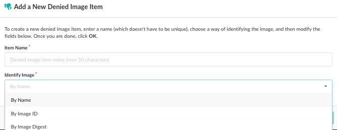
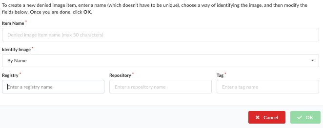
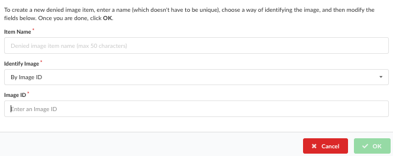
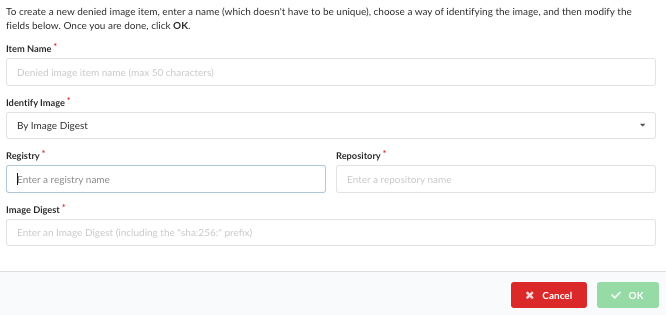
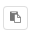
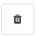
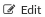

## Introduction

You can add or edit Allowed or Denied Images for your policy bundle rules. 

The *Allowed / Denied Images* tab is split into the following two sub tabs:

- **Allowed Images**
  A list of images which will always pass policy evaluation irrespective of any policies that are mapped to them.

- **Denied Images**
  A list if images which will always fail policy evaluation irrespective of any policies that are mapped to them.

  

### Add an Allowed or Denied Image to Bundle ###

1. If you do not have any allowed or denied images in your bundle, click **Let's add one!** to add them. 





The workflow for adding Allowed or Denied images is identical. 

2. Images can be referenced in one of three ways:

- By Name: including the registry, repository and tag
   eg. docker.io/library/centos:latest

   The name does not have to be unique but it is recommended that the identifier is descriptive.

   

- By Image ID: including the full image ID
   eg. e934aafc22064b7322c0250f1e32e5ce93b2d19b356f4537f5864bd102e8531f

   

   The full Image ID should be entered. This will be a 64 hex characters. There are a variety of ways to retrieve the ID of an image including using the anchore-cli, Anchore UI, and Docker command.
   

- By Image Digest: including the registry, repository and image digest of the image.
   eg.  docker.io/library/centos@sha256:989b936d56b1ace20ddf855a301741e52abca38286382cba7f44443210e96d16

   

3. Click **OK** to add the Allowed or Denied Image item to your bundle.

See the following sections for more details about the **Name**, **Image ID**, and **Image Digest**. 

For most use cases, it is recommended that the image digest is used to reference the image since an image name is ambiguous. Over time different images may be tagged with the same name. 

If an image appears on both the Allowed Images and Denied Images lists, then the Denied Image takes precedence and the image will be failed.

**Note:** See Evaluating Images against Policies for details on image policy evaluation.

The Allowed Images list will show a list of any Trusted Images defined by the system includes the following fields:

- **Allowlist Name**
  A user friendly name to identify the image(s)

- **Type**
  Describes how the image has been specified. By **Name**, **ID**, or **Digest**

- **Image**
  The specification used to define the image

- **Actions**
  The actions you can set for the allowed image..

  The  button can be used to copy the image specification into the clipboard. 

  An existing image may be deleted using the  or edited by pressed the  button.


### Adding an Image by Image ID 

The full Image ID should be entered. This will be a 64 hex characters. There are a variety of ways to retrieve the ID of an image including using the anchore-cli, Anchore UI and Docker command.

Using Anchore CLI

```
$ anchore-cli image get library/debian:latest | grep Image\ ID
Image ID: 8626492fecd368469e92258dfcafe055f636cb9cbc321a5865a98a0a6c99b8dd
```

Using Docker CLI

```
$ docker images --no-trunc debian:latest

REPOSITORY          TAG                 IMAGE ID                                                                  CREATED             SIZE
docker.io/debian    latest              sha256:8626492fecd368469e92258dfcafe055f636cb9cbc321a5865a98a0a6c99b8dd   3 days ago          101 MB
```

By default the docker CLI displays a short ID, the long ID is required and it can be displayed by using the --no-trunc parameter.

**Note:** The algorithm (sha256:) should not be entered into the Image ID field.


### Adding an Image by Digest

When adding an image by Digest the following fields are required:

- Registry
  eg. docker.io

- Repository
  eg. library/debian

- Digest
  eg. sha256:de3eac83cd481c04c5d6c7344cd7327625a1d8b2540e82a8231b5675cef0ae5f

The full identifier for this image is: docker.io/library/debian@sha256:de3eac83cd481c04c5d6c7344cd7327625a1d8b2540e82a8231b5675cef0ae5f

**Note:** The tag is not used when referencing an image by digest.

There are a variety of ways to retrieve the digest of an image including using the anchore-cli, Anchore UI, and Docker command.

Using Anchore CLI

```
$ anchore-cli image get library/debian:latest | grep Digest
Image Digest: sha256:7df746b3af67bbe182a8082a230dbe1483ea1e005c24c19471a6c42a4af6fa82
```

Using Docker CLI

```
$ docker images --digests debian
REPOSITORY          TAG                 DIGEST                                                                    IMAGE ID            CREATED             SIZE
docker.io/debian    latest              sha256:de3eac83cd481c04c5d6c7344cd7327625a1d8b2540e82a8231b5675cef0ae5f   8626492fecd3        1 days ago          101 MB
```

**Note:** Unlike the Image ID entry, the algorithm (sha256:) is required.


### Adding an Image by Name

When adding an image by **Name**, the following fields are required:

- Registry
  eg. docker.io

- Repository
  eg. library/debian

- Tag
  eg. latest.

**Note:** Wild cards are supported, so to trust all images from docker.io you would enter **docker.io** in the Registry field, and add a * in the Repository and Tag fields.

 