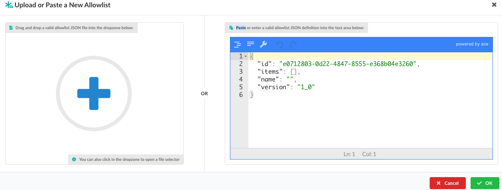

## Introduction

An Allowlist contains one or more exceptions that can be used during policy evaluation. For example allowing a CVE to be excluded from policy evaluation.

The Allowlist tab shows a list of Allowlist present in the policy bundle. Allowlist are an optional element of the bundle, and a policy bundle may contain multiple Allowlist.

### Add a New Allowlist

1. Click **Add New Allowlist** to create a new, empty Allowlist.

2. Add a name for the Allowlist. A name is required and should be unique. 

3. Optional: Add a description. A description is recommended. Often the description is updated as new entries are added to the Allowlist to explain any background.
For example "Updated to account for false positive in glibc library".

### Upload or Paste an Allowlist 

If you have a JSON document containing an existing Allowlist, then you can upload it into Anchore Enterprise.

1. Click  **Upload / Paste Allowlist** to upload an Allowlist. You can also manually edit the Allowlist in the native JSON format.

2. Allowlist files can be dragged into the dropzone, indicated by a blue plus sign. Or, you can click in the dropzone load it from a local filesystem.

3. Click **OK** to upload the Allowlist. The system will perform a validation for the Allowlist. Only validated Allowlists may be stored by Anchore Enterprise.

### Copying a Allowlists

An existing Allowlist can be copied.

1. From the Tools drop down, select **Copy Allowlist**.

2. Enter a unique name for the Allowlist.

3. Optional: Add a description. This is recommended. Often the description is updated as new entries are added to the Allowlist to explain any background.

### Downloading Allowlists

An existing Allowlists can be downloaded as a JSON file.

1. From the Tools drop down, click **Download to JSON**.

### Editing Allowlists

The Allowlists editor allows new Allowlist entries to be created, and existing entries to be edited or removed.

1. Choose an Allowlist to edit, then click **Edit**.  

Anchore Enterprise supports Allowlisting any policy trigger, however the Allowlists editor currently supports only adding Anchore Security checks, allowing vulnerabilities to be Allowlisted.

2. Choose a gate for the Allowlist, for example, **vulnerabilities**. A vulnerabilities Allowlists entry includes two elements:

3. Enter a CVE / Vulnerability Identifier. The CVE/Vulnerability Identifier field contains the vulnerability that should be matched by the Allowlists. This can include wildcards.

For example: CVE-2017-7246. This format should match the format of the CVEs shown in the image vulnerabilities report.
Wildcards are supported, however, care should be taken with using wildcards to prevent Allowlisting too many vulnerabilities.

4. Enter a package. The package name field contains the package that should be matched with a vulnerability.
For example libc-bin.

Wildcards are also supported within the Package name field.

An Allowlists entry may include entries for both the CVE and Package field to specify an exact match, for example: Vulnerability: CVE-2005-2541  Package: tar.

In other cases, wildcards may be used where a multiple packages may match a vulnerability. For example, where multiple packages are built from the same source.  Vulnerability: CVE-2017-9000  Package: bind-*

In this example the packages bind-utils, bind-libs and bind-license will all be Allowlisted for CVE-2017-9000.

Special care should be taken with wildcards in the CVE / Vulnerability Identifier field. In most cases a specific vulnerability identifier will be entered. In some exceptional cases a wild card in this field may be appropriate.

A good example of a valid use case for a wildcard in the CVE / Vulnerability Identifier field is the bind-license package. This package include a single copyright text file and is included by default in all CentOS:7 images. CVEs that are reported against the Bind project are typically applied to all packages built from the Bind source package. So when a CVE is found in Bind it is common to see a CVE reported against the bind-license package. To address this use case it is useful to add an Allowlists entry for any vulnerability (*) to the bind-license package.

Click  to edit an Allowlist.

Click **Remove** to delete an Allowlist.

Ensure that all changes are saved before exiting out of the Edit Allowlists Items Page. At that point the edits will be sent to Anchore Enterprise.

