### What is a Policy Bundle

A bundle container includes the following elements:

- **Policies**

  A policy is made up from a set of rules that are used to perform an evaluation on a source repository or container image. These rules can include checks on security vulnerabilities, package allowlists, denylists, configuration file contents, presence of credentials, manifest changes, exposed ports, or any user defined checks. These policies can be deployed site wide or customized for specific source repositories, container images, or categories of applications. A policy bundle may contain one or more named policies.

- **Allowlists**

  An allowlist contains one or more exceptions that can be used during policy evaluation. For example allowing a CVE to be excluded from policy evaluation. A policy bundle may contain multiple allowlists.

- **Mappings**

  A policy mapping defines which policies and allowlists should be used to perform the policy evaluation of a given source repository or container image. A policy bundle may contain multiple mappings including wildcard mappings that apply to multiple elements.

- **Allowed Image**

  An allowed image defines one or more images that will always pass policy evaluation regardless of any policy violations. Allowed images can be specified by name, image ID, or image digest. A policy bundle contains a single list of allowed images.  

- **Denied Images**

  A denied Images list defines one or more images that will always fail policy evaluation. Denied images can be specified by name, image ID, or image digest. A policy bundle contains a single list of denied images.

### Policy Bundles

The Policy Manager displays a list of policy bundles that are loaded in the system. Each policy bundle has a unique name, unique ID (UUID), and an optional description.

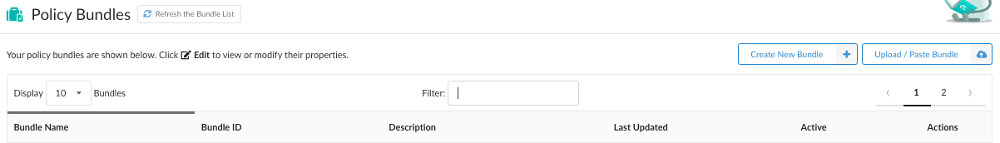

Anchore Enterprise supports multiple bundles. The Anchore API, CLI, and CI/CD plugins support specifying a bundle when requesting an source repository or container image evaluation. For example, the development team may use a different set of policy checks than the operations team. In this case, the development team would specify their bundle ID as part of their policy evaluation request.

If no bundle ID is specified, then Anchore Enterprise will use the active bundle which can be considered as the default bundle. Only one bundle can be set as default/active at any time. This bundle will be highlighted with a green ribbon.

**Note:** Bundles which are not marked as **Active** can still be explicitly requested as part of a policy evaluation. 

If multiple users are accessing the Policy Manager, or if policy bundles are being added or removed through the API or CLI, then you may update the list of bundles using the clicking **Refresh the Bundle Data**.

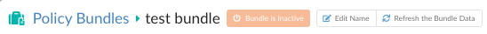

The following command can be run to list policy bundles using the Anchore CLI:

`anchore cli policy list`

### Create a New Policy Bundle

1. To create a new, empty policy bundle, click **Create New Bundle**.

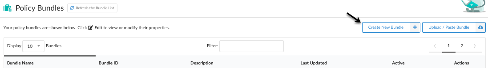

2. Add a name for the policy bundle. This name should be unique.

3. Optional: You can add a description. 

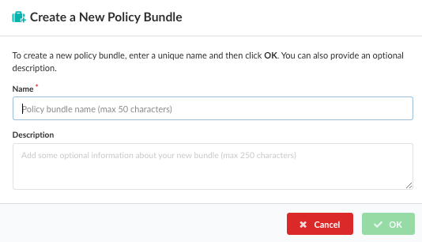

The following example shows a bundle called **test**. Notice the unique Bundle ID (UUID) that was automatically created by Anchore Enterprise.

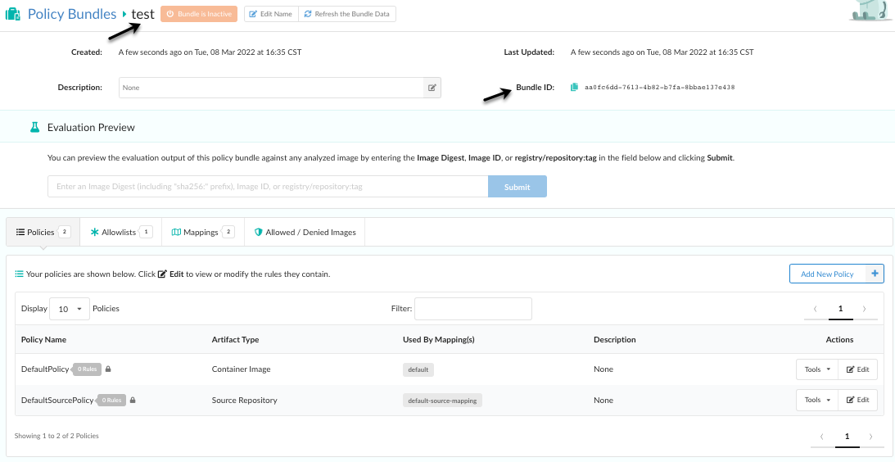

### Upload a Policy Bundle

If you have a JSON document containing an existing policy bundle, then you can upload it into Anchore Enterprise.

1. Click **Upload / Paste Bundle** to upload or paste a valid policy bundle JSON.

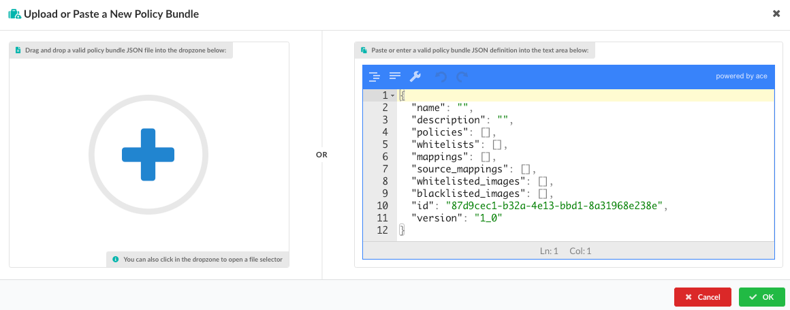

2.  You can drag Policy Bundle files into the dropzone, indicated by a blue plus sign. Or, you can click in the dropzone to load a bundle from the local file system.

3. Click **OK** to perform a validation on a bundle. Only validated bundles may be stored by Anchore Enterprise.

**Note**: The following command can be run to add policy bundles using the Anchore CLI

`anchore-cli policy add /path/to/my/policy/bundle.json`

### Edit a Policy Bundle

You can edit existing policy bundles at any time, including the policies, allowlists, mappings, and allowed or denied images. 

1. Click **Edit Policy** to open the policy bundled viewer which has the following options.

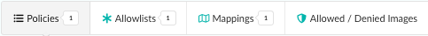

- Policies tab: Edit or add policies and policy rules. See the policies section for more information.

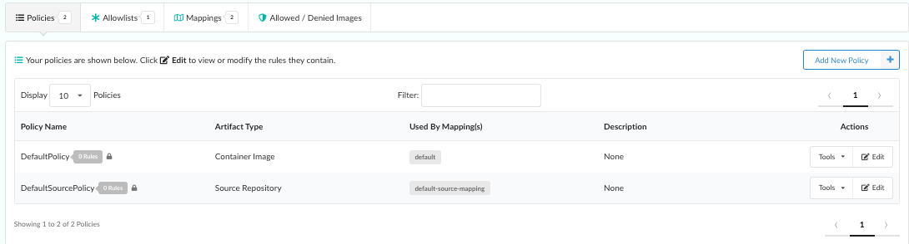

- Allowlists tab: Edit or add allowlists associated with the policy bundle.

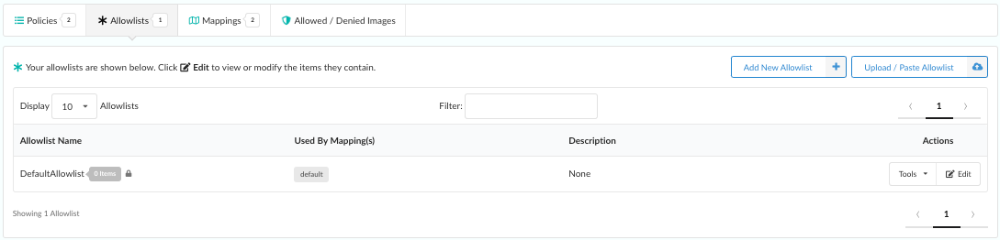

- Mappings tab: Edit or add mappings and mapping rules. See the Policy Mappings section for more information.

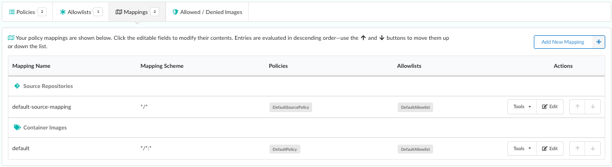

- Allowed / Denied Images tab: Edit or add images that you want allowed or denied in a policy bundle. Each of the bundle elements can be edited by selecting the appropriate tab in the navigation bar.

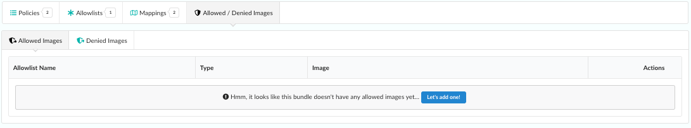

### Copy an Existing Policy Bundle

If you already have a policy bundle that you would like to use as a base for another bundle, you can make a copy of it, give it a new name, and then work with the policies, mappings, allowlists, and allowed or denied images. 

1. From the Tools list, select **Copy Bundle**.

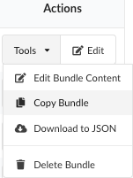

2. Enter a unique name for the copy of the bundle. 

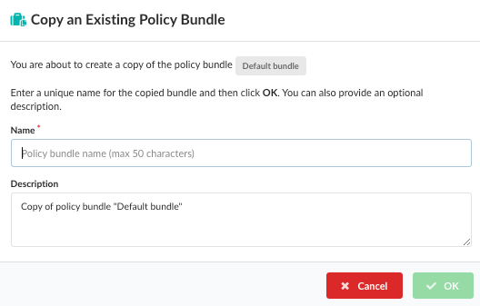

3. Optional: You can add a description to explain the bundle copy. This is recommended.

4. Click **OK** to copy the bundle.

### Delete a Policy Bundle

If you no longer use a policy bundle, you can delete it. An active (default) bundle cannot be deleted. To delete the active bundle first you must mark another bundle as active.

1. From the Tools menu, select **Delete Bundle**. 

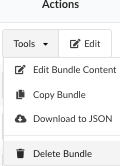

2. Click **Yes** to confirm that you want to delete the bundle. 

**Warning*: Once the bundle is deleted, you cannot recover it.

**Note**: Use the following command to delete a bundle using the Anchore CLI. The policy must be referenced by its UUID. For example:

`$ anchore-cli policy del 2c53a13c-1765-11e8-82ef-23527761d060`

### Download a Policy Bundle

1. From the Tools menu, select **Download to JSON**. 

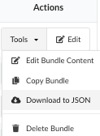 

2. The JSON file is downloaded just like any other downloaded file to your computer. Save the downloaded JSON file to your location of choice.

**Note**: Use the following command to download a bundle using the Anchore CLI. The policy must be referenced by its UUID. For example:

`$ anchore-cli policy get 2c53a13c-1765-11e8-82ef-23527761d060  --detail > bundle.json`
