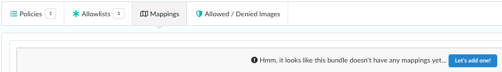
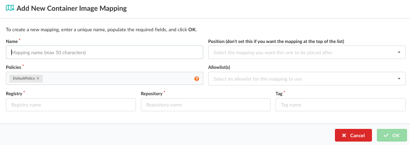

## Introduction

The Policy Mapping editor creates rules that define which policies and allowlists should be used to perform the policy evaluation of a source repository or container image based on the registry, repository name, and tag of the image.

The policy editor lets you set up different policies that will be used on different images based on the use case.

For example the policy applied to a web-facing service may have different security and operational best practices rules than a database backend service.

Mappings are set up based on the Registry, Repository, and Tag of an image. Each field supports wildcards.

For example:

| Registry | Repository | Tag |
| ----- | ------ | ------ |
| registry.example.com | Apply mapping to the registry.example.com |
| anchore/web* | Map any repository starting with web* in the anchore namespace |
| Tag | * | All tags |

In this example,an image named **registry.example.com/anchore/webapi:latest** would match this mapping, and so the policy and allowlist configured for this mapping would be applied.

The mappings are applied in order, from top to bottom and the system will stop at the first match.

**Note**: The trusted images and blacklisted images lists take precedence over the mapping. See [this document]() for details.

If the policy bundle includes no mappings, click the  to add your first mapping.

The *Add a New Mapping* dialog will be displayed and includes mandatory fields for *name, policy, registry, repository and tag*. The Allowlist(s) field is optional.

| Field Name | Description |
| ---------- | ----------- |
| **Name** | A unique name to describe the mapping. For example: "Mapping for webapps". |
| **Policies** | Name of policy to use for evaluation. A drop down will be displayed allowing selection of a single policy. |
| **Allowlist(s)** | Optional: The allowlist(s) to be applied to the source repository or container image evaluation. Multiple allowlists may be applied to the same source repository or container image. |
| **Registry** | The name of the registry to match. Note the name should exactly match the name used to submit the source repository or container image for analysis. For example: `foo.example.com:5000` is different to `foo.example.com`. Wildcards are supported. A single * would specify any registry. |
| **Repository** | The name of the repository, optionally including namespace. For example: `webapp/foo`. Wildcards are supported. A single * would specify any repository. Partial names with wildcards are supported. Foe example: `web*/*`. |
| **Tag** | Tags mapped by this rule. For example: `latest`. Wildcard are supported. A single * would match any tag. Partial names with wildcards are supported. For example: `2018*`. |

Each entry field includes an indicator showing if the current entry is valid  or has errors .

In the screenshot below you can see multiple policy mappings have been defined some of which include one or more allowlists.

Image evaluation is performed sequentially from top to bottom. The system will stop at the first match so particular care should be paid to the ordering.

Mappings can be reordered using the  buttons which will move a mapping up or down the list. Mappings may be deleted using the  button.

It is recommended that a final catch all mapping is applied to ensure that all images are mapped to a policy. This catch-all mapping should specify wildcards in the registry, repository, and tag fields.

