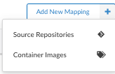

## Introduction

The container image policy mapping editor creates rules that define which policies and allowlists should be used to perform the policy evaluation of an image based on the registry, repository name, and tag of the image.

### Create a new Image Container Mapping ###

1. From the Policy Bundles screen, click **Mappings**.
2. Click **Add New Mapping**, then select **Container Images** to create the mapping from a container image.

3. From the Add New Container Image Mapping screen, add a name for the mapping, the policy for which the mapping will apply (added automatically), a registry, a repository, and a tag.  You can optionally add an allowlist and set the position for the mapping.

4. Using the policy editor, you can set up different policies that will be used on different images based on use case. For example the policy applied to a web facing service may have different security and operational best practices rules than a database backend service.
Mappings are set up based on the Registry, Repository, and Tag of an image. Each field supports wildcards.

For example:

| Registry | Repository | Tag |
| ----- | ------ | ------ |
| registry.example.com | Apply mapping to the registry.example.com |
| anchore/web* | Map any repository starting with web* in the anchore namespace |
| Tag | * | All tags |

In this example, an imaged named **registry.example.com/anchore/webapi:latest** would match this mapping, so the policy and allowlist configured for this mapping would be applied.

The mappings are applied in order, from top to bottom and the system will stop at the first match.

**Note**: The allowed images and denied images lists take precedence over the mapping. See [this document]() for details.

5. The empty policy bundle includes no mappings. Click **Let's add one!** to add your first mapping.

6. From **Add a New Container Image Mapping**, fill in the mandatory fields for **Name**, **Policy**, **Registry**, **Repository** and **Tag**. The **Allowlists** and **Position** fields are optional. See the following table for more information about these fields.

| Field Name | Description |
| ---------- | ----------- |
| **Name** | A unique name to describe the mapping. For example: "Mapping for webapps". |
| **Position** | Set the order for the new mapping. |
| **Policies** | Name of policy to use for evaluation. A drop down will be displayed allowing selection of a single policy. |
| **Allowlist(s)** | Optional: The allowlist(s) to be applied to the image evaluation. Multiple allowlists may be applied to the same image. |
| **Registry** | The name of the registry to match. Note the name should exactly match the name used to submit the image or repo for analysis. For example: `foo.example.com:5000` is different to `foo.example.com`. Wildcards are supported. A single * would specify any registry. |
| **Repository** | The name of the repository, optionally including namespace. For example: `webapp/foo`. Wildcards are supported. A single * would specify any repository. Partial names with wildcards are supported. For example: `web*/*`. |
| **Tag** | Tags mapped by this rule. For example: `latest`. Wildcard are supported. A single * would match any tag. Partial names with wildcards are supported. For example: `2018*`. |

Each entry field includes an indicator showing if the current entry is valid  or has errors .

Image evaluation is performed sequentially from top to bottom. The system will stop at the first match, so particular care should be paid to the ordering.

Mappings can be reordered using the  buttons which will move a mapping up or down the list. Mappings may be deleted using the  button.

It is recommended that a final catch-all mapping is applied to ensure that all container images are mapped to a policy. This catch-all mapping should specify wildcards in the registry, repository, and tag fields.

