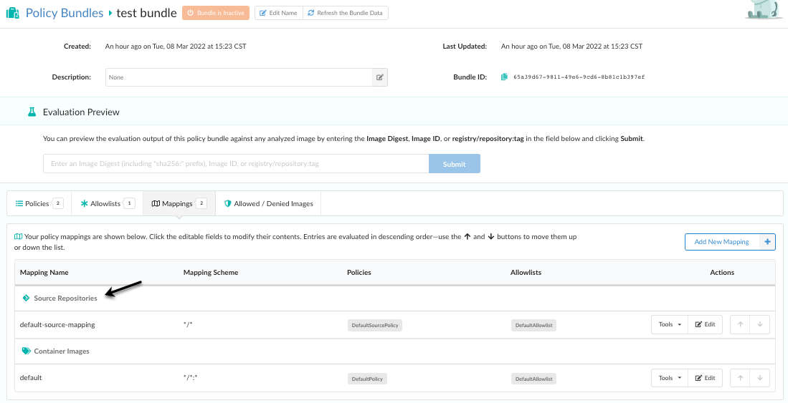
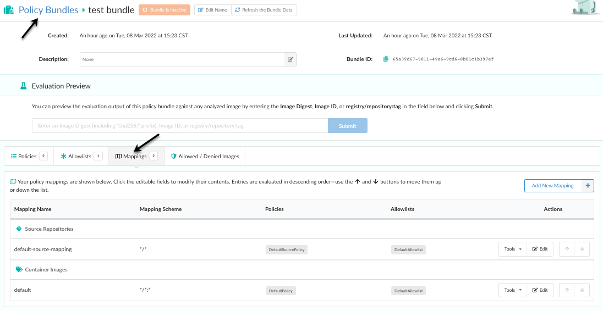
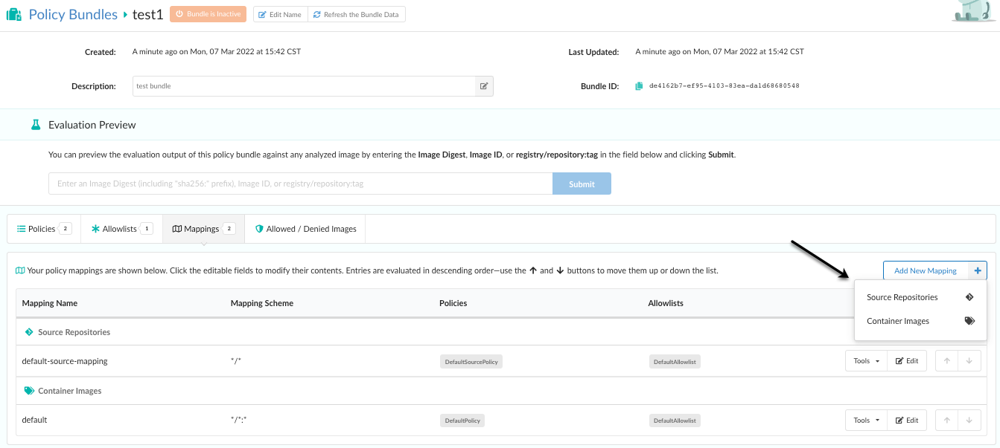
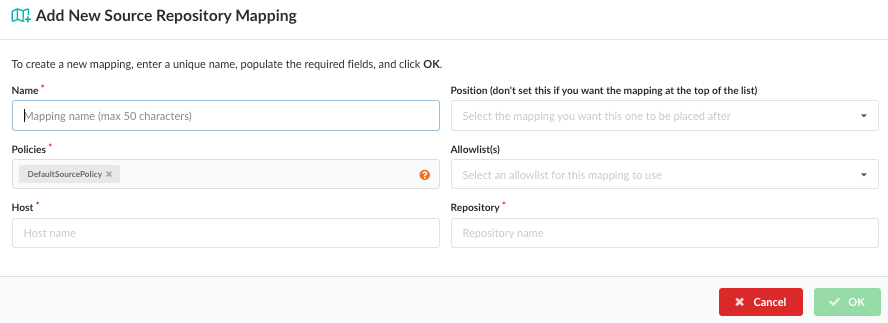

The source repository policy mapping editor creates rules that define which policies and allowlists should be used to perform the policy evaluation of a source repository based on the host, and repository name. 

Using the policy editor organizations can set up multiple policies that will be used on different source repositories based on use case. For example the policy applied to a web facing service may have different security and operational best practices rules than a database backend service.

Mappings are set up based on the **Host** and **Repository** of a source repository. Each field supports wildcards.

### Create a Source Repository Mapping ###

1. From the Policy Bundles screen, click **Mappings**.

    

2. Click **Add New Mapping**, then select **Source Repositories**. By selecting source repositories, you are saying you want the new policy rule to apply to a source repository.

    

3. From the **Add New Source Repository Mapping** dialog, add a name for the 
   mapping, choose the policy for which the mapping will apply, the position (optional) for the new mapping, a host (such as `github.com`), and a repository.  You can optionally add an allowlist and set the position for the mapping. 

    

| Field       | Description  |
|-----------------|------------------------------------------------------|
| **Name**        | A unique name to describe the mapping.               |
| **Position**    | Optional: Set the order for the new mapping.         |
| **Policies**    | Name of policy to use for evaluation. A drop down will be displayed allowing selection of a single policy.|
| **Allowlist(s)** | Optional: The allowlist(s) to be applied to the source repository evaluation. Multiple allowlists may be applied to the same source|
| **Host**        | The name of the source host to match. For example: `github.com`.|
| **Repository**  | The name of the source repository, optionally including namespace. For example: `webapp/foo`. Wildcards are supported. A single `*` would specify any repository. Partial names with wildcards are supported. For example: `web*/*`. |

4. Click **OK** to create the new mapping.