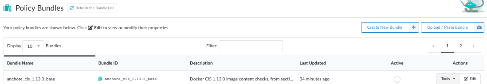
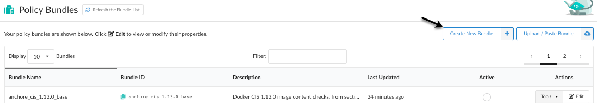
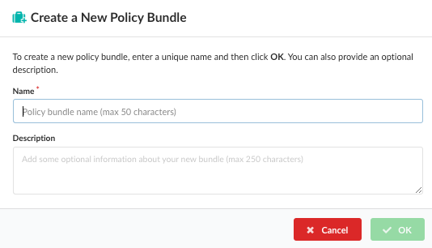
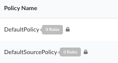
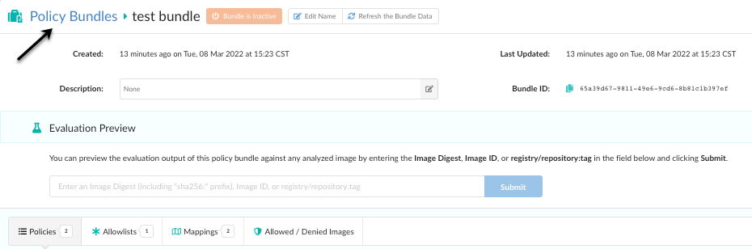
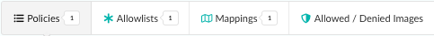
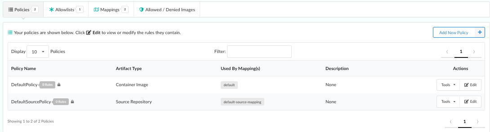
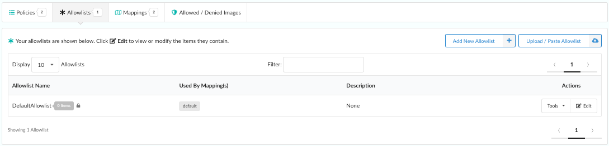
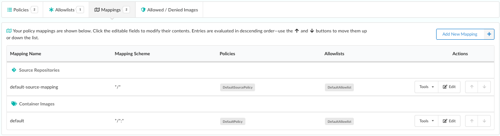
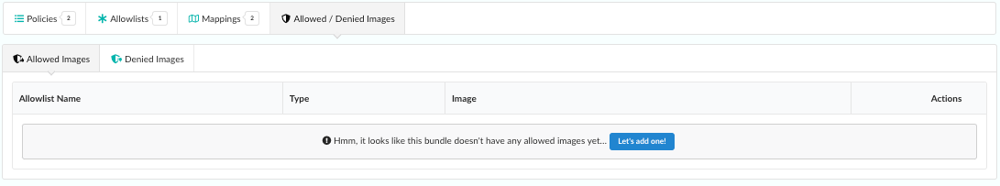

## Introduction

The main Policy Bundles page shows a list of your policy bundles. You can see the bundle names, IDs, descriptions, when they were last updated, and which bundles are active.

You can also create or add bundles, as well as edit, copy, delete, or download bundles. 

### Create a New Bundle.

Create a new policy bundle and add it to the list of policy bundles.

1. To add a new policy bundle, click **Create New Bundle**.

 

 2. Enter a unique name, along with an optional (but recommended) description for your new policy.

3. Click **OK**

Notice that when you create a new policy bundle, it is populated with two policies. **DefaultPolicy** is for a container image, and **DefaultSourcePolicy** is for a source repository. 

4. Start adding rules to your new policy bundle. You can edit existing policies, add additional policies, add new mappings or edit existing mapping rules from either source repositories or container images, set up allow lists, or allowed/denied images for your policy.

### Refresh a Policy Bundle

Click **Refresh the Bundle Data** if multiple users are accessing the Policy Manager, or if policy items are being added or removed through the API or CLI then you may update the list of bundles.

### Rename a Policy Bundle

1. Click **Edit Name** to rename the policy bundle.

2. Enter the new name.

3. Click the green check to rename the policy bundle.

### Policy Bundle Status

As described in the policy manager page, only one policy bundle may be set as active (default).

The Policy Bundle page includes a graphical icon of a robot to indicate the status of a bundle.

 This shows that the policy is active (default).

 The sleeping robot icon shows that the policy bundle is not active.

### Navigate Back to the Bundle List

Click **Policy Bundles**, or use the browsers navigation buttons to navigate back to the list of Policy Bundles.

### Edit Bundle Content

You can edit the components of the policy bundle at any time, including the policies, allowlists, mappings, and allowed or denied images.

**Policies** tab: 

Edit or add policies and policy rules. See the policies section for more information.

**Allowlists** tab: 

Edit or add allowlists associated with the policy bundle.

**Mappings** tab: 

Edit or add mappings and mapping rules. See the Policy Mappings section for more information.

**Allowed / Denied Images** tab: 

Edit or add images that you want allowed or denied in a policy bundle. Each of the bundle elements can be edited by selecting the appropriate tab in the navigation bar.

